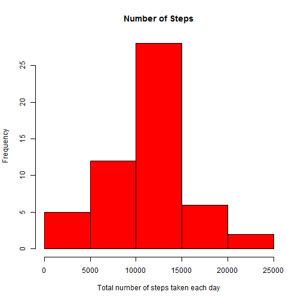

Loading and preprocessing the data
---

Unzip file and read the data


```r
unzip("activity.zip")
activity <- read.csv("activity.csv",stringsAsFactors=FALSE)
```

What is mean total number of steps taken per day?
---
Histogram of the total number of steps taken each day;

```r
stepsbydate<-aggregate(steps ~ date, data = activity, FUN = sum)
hist(stepsbydate$steps,main="Number of Steps",xlab="Total number of steps taken each day", col="red")
```

 

Mean of total number of steps taken by day;

```r
mean(stepsbydate$steps)
```

```
## [1] 10766
```

Median of total number of steps taken by day

```r
median(stepsbydate$steps)
```

```
## [1] 10765
```


What is the average daily activity pattern?
---
Time series plot of the 5-minute interval and the average number of steps taken, averaged across all days

```r
avr_steps<-aggregate(steps ~ interval, data=activity, FUN=mean)
plot(avr_steps$interval, avr_steps$steps, type="l", xlab= "5-Minute Interval", ylab= "average number of steps taken", col="blue" , lwd=2)
```

 

The 5-Minute Interval which contains the maximum number of steps on average across all days;

```r
avr_steps[which.max(avr_steps$steps), ]
```

```
##     interval steps
## 104      835 206.2
```

Imputing missing values
---
Numbers of missing / non-missing observations;

```r
missing <- is.na(activity$steps)
table(missing)
```

```
## missing
## FALSE  TRUE 
## 15264  2304
```

Imputation of missing values with interval averages (mean)

```r
# Merge activity and internal averages data
colnames(avr_steps)[2]<-"steps_int"
filled.act<-merge(activity,avr_steps,by="interval",sort=FALSE)
# Replace missing steps values with internal averages
filled.act[is.na(filled.act[,2]),2]<-filled.act[is.na(filled.act[,2]),4]
filled.act<-with(filled.act, filled.act[order(date,interval),])
head(filled.act)
```

```
##     interval   steps       date steps_int
## 1          0 1.71698 2012-10-01   1.71698
## 63         5 0.33962 2012-10-01   0.33962
## 128       10 0.13208 2012-10-01   0.13208
## 205       15 0.15094 2012-10-01   0.15094
## 264       20 0.07547 2012-10-01   0.07547
## 327       25 2.09434 2012-10-01   2.09434
```

Histogram, mean and median of the total number of steps taken each day for the imputed data;


```r
stepsbydate2<-aggregate(steps ~ date, data = filled.act, FUN = sum)
hist(stepsbydate2$steps,main="Number of Steps",xlab="Total number of steps taken each day", col="blue")
```

 

```r
mean(stepsbydate2$steps)
```

```
## [1] 10766
```

```r
median(stepsbydate2$steps)
```

```
## [1] 10766
```
Difference between initial and imputed mean of the total number of steps taken each day;

```r
mean(stepsbydate$steps)-mean(stepsbydate2$steps)
```

```
## [1] 0
```
Difference between initial and imputed median of the total number of steps taken each day;

```r
median(stepsbydate$steps)-median(stepsbydate2$steps)
```

```
## [1] -1.189
```


Are there differences in activity patterns between weekdays and weekends?
---
Creating a new factor variable in the dataset with two levels -- "weekday" and "weekend" indicating whether a given date is a weekday or weekend day;

```r
wdaywend <- c("Weekday", "Weekend")
dateconvert <- function(date) {
    day <- weekdays(date)
    part <- factor("Weekday", wdaywend)
    if (day %in% c("Saturday", "Sunday")) 
        part <- factor("Weekend", wdaywend)
    return(part)
}

filled.act$wday <- sapply(as.Date(filled.act$date,"%Y-%m-%d"), dateconvert)
```
The panel plot containing a time series plot of the 5-minute interval and the average number of steps taken, averaged across all weekday days or weekend days;

```r
avg_steps_wday<-aggregate(steps ~ interval + wday,data = filled.act,FUN = mean)
library(lattice)
plot<-xyplot(steps ~ interval | wday,type = "l", data=avg_steps_wday,xlab="5-Minute Interval",ylab="Average Number od Steps Taken",col="red")
print(plot)
```

 
